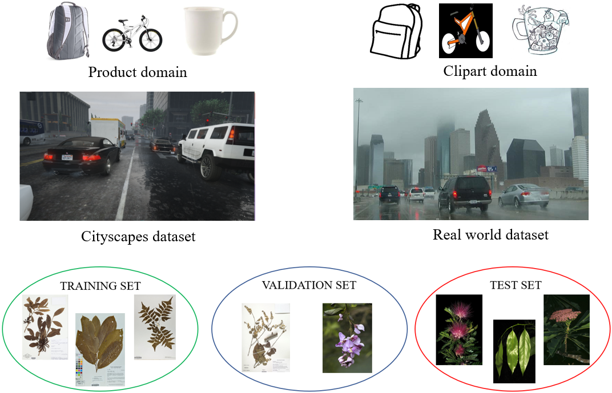

Transfer Learning
======
<b>Transfer learning</b> leverages existing models or labeled data to solve another similar but different problem. My research focuses on one type of transfer learning paradigms: domain adaptation. Due to the differences between different domains, termed data bias or domain shift, machine learning models often do not generalize well from an existing domain to a novel unlabeled domain. <b>Domain adaptation (DA)</b> has been proposed to leverage knowledge from an abundant labeled source domain to learn an effective predictor for the target domain with few or no labels, while mitigating the domain shift problem. In my research, DA has been applied in many tasks, such as image recognition, segmentation, regression, etc.

  

 <b>Data shift/bias</b> of different datasets when transferring knowledge from an existing domain to another domain (learn from product domain, and recognize objects in clipart domain; segment cityscapes dataset and apply it to the real-world dataset; identify plant species from one set to another set).
<b>Domain adaptation</b> aims to reduce data shift issue, and improve models' performance in the new domain. 

# Cow Teat Health Management

# Manifold Learning and Shape Analysis

